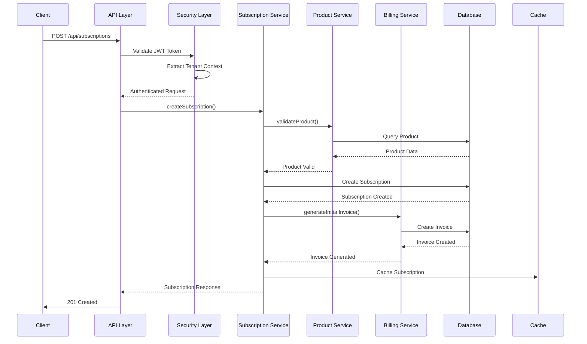
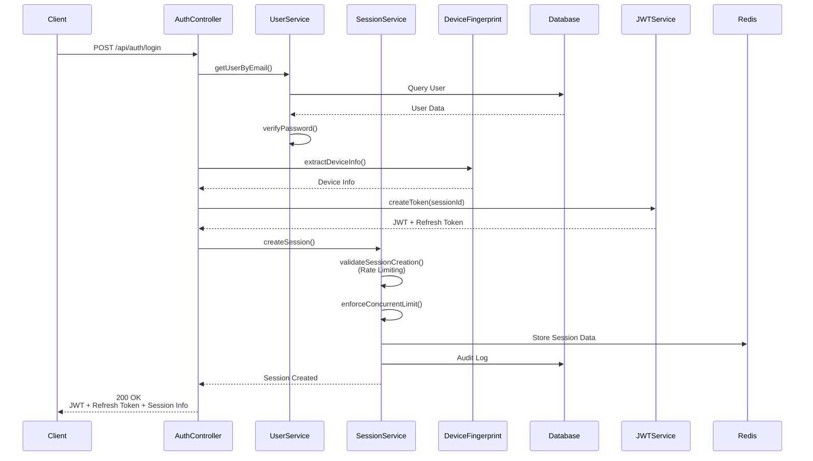
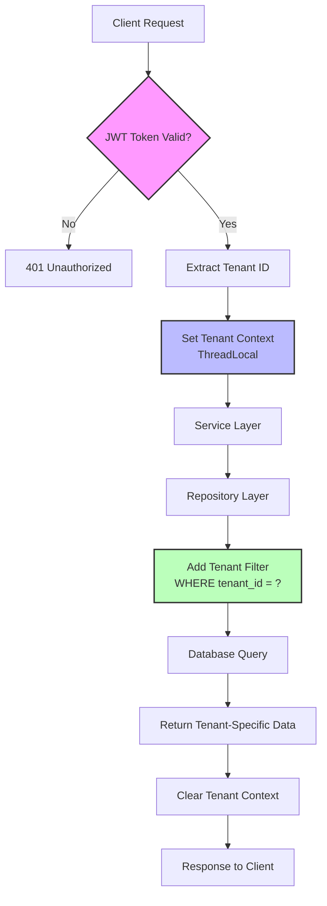

# FluxPay Orchestration Engine

[](https://github.com/serhatsoysal/fluxpay-orchestration-engine/actions)
[](https://github.com/serhatsoysal/fluxpay-orchestration-engine/security/code-scanning)
[](https://sonarcloud.io/dashboard?id=serhatsoysal_fluxpay-orchestration-engine)
[](https://sonarcloud.io/dashboard?id=serhatsoysal_fluxpay-orchestration-engine)
[](https://codecov.io/gh/serhatsoysal/fluxpay-orchestration-engine)
[](https://www.oracle.com/java/technologies/javase/jdk21-archive-downloads.html)
[](https://spring.io/projects/spring-boot)
[](https://opensource.org/licenses/MIT)

## 📋 Table of Contents

- [Overview](#overview)
- [Project Purpose](#project-purpose)
- [Architecture](#architecture)
- [Technology Stack](#technology-stack)
- [Features](#features)
- [System Flow](#system-flow)
- [Getting Started](#getting-started)
- [API Documentation](#api-documentation)
- [Session Management](#session-management)
- [Project Structure](#project-structure)
- [Development](#development)
- [Security](#security)
- [Contributing](#contributing)
- [License](#license)

## 🎯 Overview

**FluxPay Orchestration Engine** is an enterprise-grade, multi-tenant SaaS subscription management and billing orchestration platform designed to handle complex subscription business models with flexible pricing strategies, automated invoicing, and comprehensive tenant isolation.

Built with modern Java technologies and following microservices architecture principles, FluxPay provides a robust foundation for SaaS businesses requiring scalable subscription management, automated billing cycles, and comprehensive payment processing capabilities.

## 🎯 Project Purpose

FluxPay Orchestration Engine addresses the critical need for a comprehensive, enterprise-ready solution that:

- **Orchestrates Complex Subscription Models**: Supports multiple pricing strategies (flat-rate, per-unit, tiered) with flexible billing cycles
- **Ensures Tenant Isolation**: Implements strict multi-tenant architecture with data isolation at the application and database levels
- **Automates Billing Operations**: Handles invoice generation, payment processing, and subscription lifecycle management automatically
- **Provides Enterprise Security**: Implements JWT-based authentication, role-based access control, and comprehensive security scanning
- **Enables Scalability**: Built with modern Java 21 features (virtual threads) and Spring Boot for high-performance, scalable applications
- **Maintains Code Quality**: Integrated with SonarCloud, CodeQL, and Trivy for continuous code quality and security monitoring

## 🏗️ Architecture

### Architecture Overview

FluxPay follows a **modular monolith architecture** with clear separation of concerns, enabling future migration to microservices if needed. The system is organized into domain-driven modules, each responsible for specific business capabilities.

### Design Patterns

- **Domain-Driven Design (DDD)**: Each module represents a bounded context with its own entities, services, and repositories
- **Layered Architecture**: Clear separation between API, Service, Repository, and Entity layers
- **Multi-Tenant Architecture**: Row-level security with tenant context isolation using ThreadLocal
- **Repository Pattern**: Data access abstraction through Spring Data JPA repositories
- **Service Layer Pattern**: Business logic encapsulation in service classes
- **DTO Pattern**: Data transfer objects for API communication
- **Exception Handling**: Centralized exception handling with custom exception hierarchy

### Module Responsibilities

| Module | Responsibility | Key Components |
|--------|---------------|----------------|
| **fluxpay-common** | Shared utilities, base entities, DTOs, enums, exceptions | BaseEntity, common exceptions, shared DTOs |
| **fluxpay-security** | Authentication, authorization, tenant context | JWT service, SecurityConfig, TenantContext |
| **fluxpay-tenant** | Tenant and user management | Tenant, User entities, TenantService |
| **fluxpay-product** | Product catalog and pricing models | Product, Price, ProductFeature, ProductService |
| **fluxpay-subscription** | Subscription lifecycle management | Subscription, SubscriptionItem, SubscriptionService |
| **fluxpay-billing** | Invoice generation and payment processing | Invoice, InvoiceItem, Payment, BillingService |
| **fluxpay-api** | REST API layer, controllers, main application | Controllers, DTOs, application configuration |

### Data Flow Architecture

```
┌─────────────┐
│   Client    │
│  (Frontend) │
└──────┬──────┘
       │ HTTP/REST
       ▼
┌─────────────────────────────────────────────────────────┐
│              fluxpay-api (REST Layer)                    │
│  ┌──────────┐  ┌──────────┐  ┌──────────┐            │
│  │   Auth   │  │  Tenant  │  │ Product  │  ...        │
│  │Controller│  │Controller│  │Controller│            │
│  └────┬─────┘  └────┬─────┘  └────┬─────┘            │
└───────┼─────────────┼──────────────┼──────────────────┘
        │             │              │
        ▼             ▼              ▼
┌─────────────────────────────────────────────────────────┐
│              Security Layer (JWT + Tenant Context)      │
│  ┌──────────────┐  ┌──────────────────┐               │
│  │ JWT Filter   │  │ Tenant Context   │               │
│  │              │  │ (ThreadLocal)    │               │
│  └──────┬───────┘  └────────┬─────────┘               │
└─────────┼──────────────────┼──────────────────────────┘
          │                  │
          ▼                  ▼
┌─────────────────────────────────────────────────────────┐
│              Service Layer (Business Logic)              │
│  ┌──────────┐  ┌──────────┐  ┌──────────┐            │
│  │ Tenant   │  │ Product  │  │Subscription│           │
│  │ Service  │  │ Service  │  │  Service  │  ...       │
│  └────┬─────┘  └────┬─────┘  └────┬──────┘            │
└───────┼─────────────┼──────────────┼──────────────────┘
        │             │              │
        ▼             ▼              ▼
┌─────────────────────────────────────────────────────────┐
│              Repository Layer (Data Access)             │
│  ┌──────────┐  ┌──────────┐  ┌──────────┐            │
│  │ Tenant   │  │ Product   │  │Subscription│           │
│  │Repository│  │Repository│  │ Repository│  ...       │
│  └────┬─────┘  └────┬─────┘  └────┬──────┘            │
└───────┼─────────────┼──────────────┼──────────────────┘
        │             │              │
        ▼             ▼              ▼
┌─────────────────────────────────────────────────────────┐
│              Database Layer (PostgreSQL)                 │
│  ┌──────────────────────────────────────┐              │
│  │  Multi-Tenant Database with          │              │
│  │  Row-Level Security (tenant_id)      │              │
│  └──────────────────────────────────────┘              │
└─────────────────────────────────────────────────────────┘
        │
        ▼
┌─────────────────────────────────────────────────────────┐
│              Cache Layer (Redis)                         │
│  ┌──────────────────────────────────────┐              │
│  │  Enterprise Session Management       │              │
│  │  - JWT + Refresh Tokens              │              │
│  │  - Device Fingerprinting             │              │
│  │  - Rate Limiting                     │              │
│  │  - Token Blacklisting                │              │
│  └──────────────────────────────────────┘              │
└─────────────────────────────────────────────────────────┘
```

## 💻 Technology Stack

### Core Technologies

| Category | Technology | Version | Purpose |
|----------|-----------|---------|---------|
| **Language** | Java | 21 | Core programming language with virtual threads support |
| **Framework** | Spring Boot | 3.4.5 | Application framework and dependency injection |
| **Database** | PostgreSQL | 16+ | Primary relational database with JSONB support |
| **Cache** | Redis | 7+ | Enterprise session management, rate limiting, and caching |
| **Build Tool** | Maven | 3.8+ | Dependency management and build automation |
| **Resilience** | Resilience4j | 2.2.0 | Circuit breaker, retry patterns, and fault tolerance |

### Spring Ecosystem

| Component | Technology | Purpose |
|-----------|-----------|---------|
| **Web** | Spring Web MVC | RESTful API development |
| **Data** | Spring Data JPA | Database abstraction and repository pattern |
| **Security** | Spring Security | Authentication and authorization |
| **Validation** | Bean Validation | Input validation |
| **Auditing** | JPA Auditing | Automatic timestamp management |

### Security & Authentication

| Technology | Purpose |
|------------|---------|
| **JWT (JSON Web Tokens)** | Stateless authentication with HS512 algorithm |
| **Redis Session Store** | Enterprise session management and token storage |
| **Refresh Tokens** | Long-lived tokens with rotation for enhanced security |
| **BCrypt** | Password hashing with salt |
| **Spring Security** | Security framework integration |
| **ua-parser** | Device fingerprinting for anomaly detection |
| **CORS** | Cross-origin resource sharing configuration |

### Development Tools

| Tool | Purpose |
|------|---------|
| **Lombok** | Reduces boilerplate code |
| **MapStruct** | Type-safe bean mapping |
| **Hypersistence Utils** | Hibernate utilities for JSONB support |
| **Spring Dotenv** | Environment variable management |
| **Resilience4j** | Circuit breaker and retry patterns |
| **ua-parser** | User agent parsing for device detection |

### Testing & Quality

| Tool | Purpose |
|------|---------|
| **JUnit 5** | Unit and integration testing |
| **JaCoCo** | Code coverage analysis |
| **Checkstyle** | Code style enforcement |
| **SonarCloud** | Code quality and security analysis |
| **CodeQL** | Security vulnerability scanning |
| **Trivy** | Dependency vulnerability scanning |

### DevOps & CI/CD

| Tool | Purpose |
|------|---------|
| **GitHub Actions** | Continuous Integration and Deployment |
| **Docker** | Containerization |
| **Docker Compose** | Local development environment |
| **Codecov** | Coverage reporting |

## ✨ Features

### Core Features

- ✅ **Multi-Tenant Architecture**: Complete tenant isolation with row-level security
- ✅ **Enterprise Session Management**: JWT + Redis hybrid with refresh token rotation
- ✅ **Multi-Device Support**: Concurrent session limits with device tracking
- ✅ **Flexible Pricing Models**: Support for flat-rate, per-unit, and tiered pricing
- ✅ **Subscription Lifecycle**: Complete management of trial, active, canceled, and paused states
- ✅ **Automated Invoicing**: Automatic invoice generation and payment processing
- ✅ **RESTful API**: Comprehensive REST API with proper HTTP status codes
- ✅ **Error Handling**: Centralized exception handling with meaningful error messages
- ✅ **Data Validation**: Input validation using Bean Validation annotations
- ✅ **Audit Trail**: Automatic tracking of creation and modification timestamps
- ✅ **Soft Delete**: Logical deletion with recovery capability

### Security Features

- 🔒 **Enterprise Session Management**: JWT + Redis with refresh token rotation
- 🔒 **Device Fingerprinting**: Browser and device tracking with anomaly detection
- 🔒 **Token Blacklisting**: Invalidated tokens stored in Redis for security
- 🔒 **Rate Limiting**: Redis-based rate limiting (5/min session creation, 1000/min requests)
- 🔒 **Concurrent Session Control**: Maximum 5 active sessions per user
- 🔒 **Password Hashing**: BCrypt with automatic salt generation
- 🔒 **JWT Security**: HS512 algorithm with configurable expiration
- 🔒 **SQL Injection Protection**: Parameterized queries via JPA
- 🔒 **CORS Configuration**: Configurable cross-origin policies
- 🔒 **Security Scanning**: Automated vulnerability detection with CodeQL and Trivy
- 🔒 **Audit Logging**: Session lifecycle events stored in PostgreSQL
- 🔒 **Code Quality**: Continuous monitoring with SonarCloud

### Operational Features

- 🚀 **High Performance**: Java 21 virtual threads for improved concurrency
- 🚀 **Fault Tolerance**: Resilience4j circuit breaker and retry patterns
- 🚀 **Scalability**: Modular architecture enabling horizontal scaling
- 🚀 **Redis Caching**: High-performance session and data caching
- 🚀 **Async Operations**: Non-blocking audit logging and event processing
- 🚀 **Monitoring**: Integration with SonarCloud for code quality metrics
- 🚀 **CI/CD**: Automated testing and deployment pipelines
- 🚀 **Documentation**: Comprehensive API and project documentation

## 🔄 System Flow

### Subscription Creation Flow



### Authentication & Session Management Flow



### Multi-Tenant Data Isolation Flow



## 🚀 Getting Started

### Prerequisites

- **Java 21** or higher
- **Maven 3.8+**
- **PostgreSQL 16+**
- **Redis 7+**
- **Docker** (optional, for containerized setup)

### Installation Steps

#### 1. Clone the Repository

```bash
git clone https://github.com/serhatsoysal/fluxpay-orchestration-engine.git
cd fluxpay-orchestration-engine
```

#### 2. Configure Environment

Create a `.env` file in the root directory:

```bash
cp .env.example .env
```

**Generate JWT Secret:**

**Linux/Mac:**
```bash
openssl rand -base64 64
```

**Windows PowerShell:**
```powershell
$bytes = New-Object byte[] 64
$rng = New-Object Security.Cryptography.RNGCryptoServiceProvider
$rng.GetBytes($bytes)
[Convert]::ToBase64String($bytes)
```

Update the `JWT_SECRET` value in your `.env` file.

#### 3. Start Infrastructure Services

Using Docker Compose:

```bash
docker-compose up -d
```

This will start:
- PostgreSQL on port `5432`
- Redis on port `6379`

#### 4. Create Database

Connect to PostgreSQL and create the database:

```sql
CREATE DATABASE fluxpay;
```

Update database credentials in `.env` file to match Docker Compose configuration:
- `DB_USERNAME=postgres`
- `DB_PASSWORD=postgres`
- `DB_NAME=fluxpay`

#### 5. Build the Project

```bash
mvn clean install
```

#### 6. Run the Application

```bash
cd fluxpay-api
mvn spring-boot:run
```

The API will be available at `http://localhost:8080`

### Verify Installation

Test the health endpoint:

```bash
curl http://localhost:8080/actuator/health
```

## 📚 API Documentation

### Base URL

```
http://localhost:8080/api
```

### Authentication

#### Login

```http
POST /api/auth/login
Content-Type: application/json

{
  "email": "user@example.com",
  "password": "password123"
}
```

**Response:**
```json
{
  "token": "eyJhbGciOiJIUzUxMiJ9...",
  "refreshToken": "550e8400-e29b-41d4-a716-1234567890",
  "sessionId": "a7b8c9d0-e1f2-3g4h-5i6j-7k8l9m0n1o2p",
  "userId": "123e4567-e89b-12d3-a456-426614174000",
  "tenantId": "987fcdeb-51a0-12d3-b456-426614174000",
  "role": "ADMIN",
  "expiresIn": 3600000,
  "refreshExpiresIn": 2592000000
}
```

#### Refresh Token

```http
POST /api/auth/refresh
Content-Type: application/json

{
  "refreshToken": "550e8400-e29b-41d4-a716-1234567890"
}
```

**Response:**
```json
{
  "token": "eyJhbGciOiJIUzUxMiJ9...",
  "refreshToken": "new-refresh-token-here",
  "sessionId": "a7b8c9d0-e1f2-3g4h-5i6j-7k8l9m0n1o2p",
  "expiresIn": 3600000,
  "refreshExpiresIn": 2592000000
}
```

#### Logout

```http
POST /api/auth/logout
Authorization: Bearer <your-jwt-token>
```

**Response:** `204 No Content`

#### Logout All Devices

```http
POST /api/auth/logout-all
Authorization: Bearer <your-jwt-token>
```

**Response:** `204 No Content`

#### Get Active Sessions

```http
GET /api/auth/sessions
Authorization: Bearer <your-jwt-token>
```

**Response:**
```json
[
  {
    "sessionId": "a7b8c9d0-e1f2-3g4h-5i6j-7k8l9m0n1o2p",
    "deviceInfo": {
      "deviceType": "desktop",
      "os": "Windows",
      "osVersion": "10",
      "browser": "Chrome",
      "browserVersion": "120"
    },
    "ipAddress": "192.168.1.100",
    "createdAt": "2025-01-09T10:30:00Z",
    "lastAccess": "2025-01-09T12:45:00Z"
  }
]
```

### Tenant Management

| Method | Endpoint | Description | Auth Required |
|--------|----------|-------------|---------------|
| `POST` | `/api/tenants/register` | Register new tenant | No |
| `GET` | `/api/tenants/{id}` | Get tenant details | Yes |
| `PUT` | `/api/tenants/{id}` | Update tenant | Yes |

### Products

| Method | Endpoint | Description | Auth Required |
|--------|----------|-------------|---------------|
| `POST` | `/api/products` | Create product | Yes |
| `GET` | `/api/products` | List products | Yes |
| `GET` | `/api/products/{id}` | Get product details | Yes |
| `POST` | `/api/products/{id}/prices` | Add price to product | Yes |

### Subscriptions

| Method | Endpoint | Description | Auth Required |
|--------|----------|-------------|---------------|
| `POST` | `/api/subscriptions` | Create subscription | Yes |
| `GET` | `/api/subscriptions/{id}` | Get subscription details | Yes |
| `POST` | `/api/subscriptions/{id}/cancel` | Cancel subscription | Yes |
| `POST` | `/api/subscriptions/{id}/pause` | Pause subscription | Yes |
| `POST` | `/api/subscriptions/{id}/resume` | Resume subscription | Yes |

### Invoices

| Method | Endpoint | Description | Auth Required |
|--------|----------|-------------|---------------|
| `GET` | `/api/invoices/{id}` | Get invoice details | Yes |
| `GET` | `/api/invoices/customer/{customerId}` | List customer invoices | Yes |
| `POST` | `/api/invoices/{id}/finalize` | Finalize invoice | Yes |
| `POST` | `/api/invoices/{id}/void` | Void invoice | Yes |

### Authentication Header

For authenticated requests, include the JWT token in the Authorization header:

```http
Authorization: Bearer <your-jwt-token>
```

## 🔐 Session Management

FluxPay implements **enterprise-grade session management** with the following features:

### Features

- ✅ **JWT + Redis Hybrid**: Stateless JWT tokens with server-side session validation
- ✅ **Refresh Token Rotation**: Automatic rotation of refresh tokens for enhanced security
- ✅ **Device Fingerprinting**: Browser and device tracking using ua-parser
- ✅ **Multi-Device Support**: Manage up to 5 concurrent sessions per user
- ✅ **Token Blacklisting**: Invalidated tokens stored in Redis to prevent reuse
- ✅ **Rate Limiting**: Redis-based rate limiting (5/min session creation, 1000/min requests)
- ✅ **Anomaly Detection**: Geographic and device fingerprint anomaly detection
- ✅ **Audit Logging**: All session events logged to PostgreSQL for compliance
- ✅ **Circuit Breaker**: Resilience4j patterns for Redis failure handling
- ✅ **Async Operations**: Non-blocking audit logging for high performance

### Session Configuration

Session behavior is configurable via `application.yml`:

```yaml
session:
  ttl:
    access-token: 1h        # Access token expiration
    refresh-token: 30d      # Refresh token expiration
  concurrent:
    max-sessions: 5         # Maximum concurrent sessions per user
  security:
    fingerprint-verification: true  # Enable device fingerprint validation
    anomaly-detection: true         # Enable anomaly detection
  audit:
    retention-days: 365     # Audit log retention period
```

### Frontend Integration

For comprehensive frontend integration instructions, see [SESSION_MANAGEMENT_INTEGRATION.md](SESSION_MANAGEMENT_INTEGRATION.md) which includes:

- API endpoint documentation
- Request/response schemas
- Token storage strategies
- Automatic token refresh implementation
- Device fingerprint generation
- Error handling patterns
- Complete code examples for React/TypeScript

### Database Tables

The session management system uses the following PostgreSQL tables:

- **session_audit_logs**: Session lifecycle events and security events
- **session_events**: Detailed event tracking for analytics

Session data is stored in Redis with automatic expiration and the following key patterns:

- `session:{tenantId}:{userId}:{sessionId}` - Session data
- `blacklist:{token}` - Blacklisted tokens
- `user_sessions:{tenantId}:{userId}` - User's active sessions
- `refresh:{refreshToken}` - Refresh token mapping

## 📁 Project Structure

```
fluxpay-orchestration-engine/
├── fluxpay-common/              # Shared utilities and base components
│   ├── entity/                  # BaseEntity with common fields
│   ├── dto/                     # Shared DTOs
│   ├── enums/                   # Common enumerations
│   └── exception/               # Custom exception classes
│
├── fluxpay-security/            # Security and session management
│   ├── config/                  # Security configuration
│   ├── jwt/                     # JWT token service
│   ├── session/                 # Enterprise session management
│   │   ├── model/              # Session data models
│   │   ├── entity/             # Session audit entities
│   │   ├── repository/         # Session repositories (Redis + JPA)
│   │   ├── service/            # Session services
│   │   └── config/             # Session configuration
│   └── context/                 # Tenant context management
│
├── fluxpay-tenant/              # Tenant and user management
│   ├── entity/                  # Tenant, User entities
│   ├── repository/              # Data access layer
│   └── service/                 # Business logic
│
├── fluxpay-product/             # Product catalog and pricing
│   ├── entity/                  # Product, Price, ProductFeature
│   ├── repository/              # Product repositories
│   └── service/                 # Product services
│
├── fluxpay-subscription/        # Subscription lifecycle
│   ├── entity/                  # Subscription, SubscriptionItem
│   ├── repository/              # Subscription repositories
│   └── service/                 # Subscription services
│
├── fluxpay-billing/             # Invoicing and payments
│   ├── entity/                  # Invoice, InvoiceItem, Payment
│   ├── repository/              # Billing repositories
│   └── service/                 # Billing services
│
├── fluxpay-api/                 # REST API layer
│   ├── controller/              # REST controllers
│   ├── dto/                     # API DTOs
│   ├── exception/               # Exception handlers
│   └── FluxPayApplication.java  # Main application class
│
├── fluxpay-coverage-report/     # Coverage aggregation module
│
├── .github/                     # GitHub workflows and templates
│   └── workflows/               # CI/CD pipelines
│
├── docker-compose.yml           # Local development environment
├── pom.xml                      # Root Maven POM
├── checkstyle.xml               # Code style configuration
├── sonar-project.properties     # SonarCloud configuration
└── README.md                    # This file
```

## 🛠️ Development

### Running Tests

```bash
# Run all tests
mvn test

# Run tests with coverage
mvn clean test jacoco:report

# View coverage report
open fluxpay-coverage-report/target/site/jacoco-aggregate/index.html
```

### Code Quality

#### Checkstyle

```bash
mvn checkstyle:check
```

#### SonarCloud Analysis

SonarCloud analysis runs automatically on push to `master` or `development` branches. You can also trigger it manually from GitHub Actions.

### Building

```bash
# Clean and build
mvn clean install

# Skip tests
mvn clean install -DskipTests

# Build specific module
cd fluxpay-api
mvn clean install
```

### Development with Docker

```bash
# Start services
docker-compose up -d

# View logs
docker-compose logs -f

# Stop services
docker-compose down
```

## 🔒 Security

### Security Features

- **Enterprise Session Management**: JWT + Redis hybrid with refresh token rotation
- **Device Fingerprinting**: Browser and OS detection with anomaly alerts
- **Token Blacklisting**: Redis-based token invalidation
- **Rate Limiting**: Configurable rate limits per operation
- **Concurrent Session Control**: Automatic oldest session eviction
- **JWT Authentication**: HS512 algorithm with configurable expiration
- **Password Hashing**: BCrypt with automatic salt generation
- **SQL Injection Protection**: Parameterized queries via JPA
- **CORS Configuration**: Configurable cross-origin resource sharing
- **Security Scanning**: Automated vulnerability detection
- **Audit Logging**: GDPR-compliant session event tracking
- **Fault Tolerance**: Circuit breaker and retry patterns
- **Code Quality**: Continuous security monitoring

### Security Best Practices

1. **Never commit secrets**: The `.env` file is in `.gitignore`
2. **Use strong JWT secrets**: Generate secure random keys
3. **Regular updates**: Keep dependencies updated via Dependabot
4. **Security scanning**: CodeQL and Trivy scans run on every push
5. **Code review**: All changes require code review before merge

### Security Scanning

The project includes automated security scanning:

- **CodeQL**: Static analysis for security vulnerabilities
- **Trivy**: Dependency vulnerability scanning
- **SonarCloud**: Code quality and security analysis
- **Dependabot**: Automated dependency updates

## 🤝 Contributing

We welcome contributions! Please follow these steps:

1. **Fork the repository**
2. **Create a feature branch** (`git checkout -b feature/amazing-feature`)
3. **Make your changes** following the code style guidelines
4. **Run tests** (`mvn test`)
5. **Commit your changes** (`git commit -m 'Add amazing feature'`)
6. **Push to the branch** (`git push origin feature/amazing-feature`)
7. **Open a Pull Request**

### Code Style

- Follow Java naming conventions
- Use Checkstyle for code style validation
- Write meaningful commit messages
- Add tests for new features
- Update documentation as needed

## 📄 License

This project is licensed under the MIT License - see the [LICENSE](LICENSE) file for details.

## 👤 Contact

**Serhat Soysal**

- GitHub: [@serhatsoysal](https://github.com/serhatsoysal)
- Project Link: [https://github.com/serhatsoysal/fluxpay-orchestration-engine](https://github.com/serhatsoysal/fluxpay-orchestration-engine)

## 🙏 Acknowledgments

- Spring Boot team for the excellent framework
- PostgreSQL community for robust database support
- All open-source contributors whose libraries make this project possible

---

**Made with ❤️ using Java 21 and Spring Boot 3.4.5**
